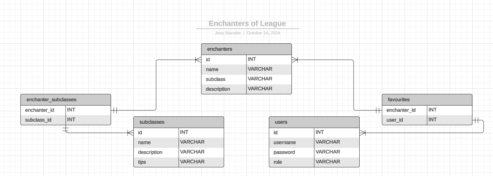
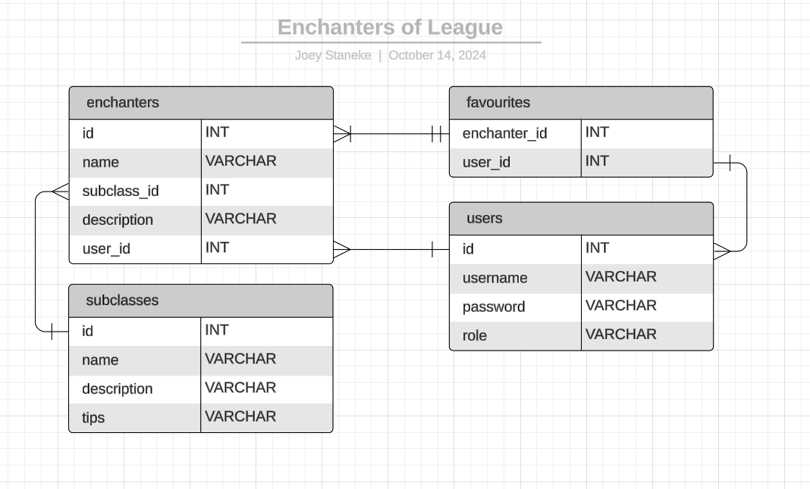

Quick copy, DELETE LATER.
- php artisan serve
- npm run dev

<b>10/10/2024</b>

First commit on new repository.

<b>13/10/2024</b>

Made homeController and view

Made task list and prioritisations:

- Maken homepagina - tussen les 4 en 5 - must have
- Maken aboutpagina - tussen les 4 en 5 - could have
- Individuele productpagina - tussen les 5 en 6 - must have
- Accaunts en autorisatie - tussen les 6 en 7 - must have
- Beveileging - tussen les 7 en 8 - should have
- Bugfixing en polishing - na les 8 - would rather have it than not

Made ERD:

<b>14/10/2024</b>

Remade ERD:

And adjusted to feedback:

<b>15/10/2024</b>

Made list of enchanters on home page.

Made details page of enchanters.

Connected thsoe 2.

Forgot to push to Github :(

<b>17/10/2024</b>

Pushed to Github what I forgot.

Updated the styling.

Made the subclasses page.

Connected the subclasses and the enchanter page.

<b>20/10/2024</b>

Updated wording on pages to be more clear.

<b>21/10/2024</b>

Made form for enchanters page.

<b>22/10/2024</b>

Made form for subclasses page.

Made forms _actually_ working (woohoo).

Made dropdown for subclasses

<b>23/10/2024</b>

Made custom dashboard page.

<b>28/10/2024</b>

Added secure validation

<b>1/11/2024</b>

PHPStorm stopped working for some reason, had to continue the project in VSCode, couldn't troubleshoot the problem.

<b>2/11/2024</b>

Made admin page

Made edit page

<b>3/11/2024</b>

Made deeper validation

Made filtering
